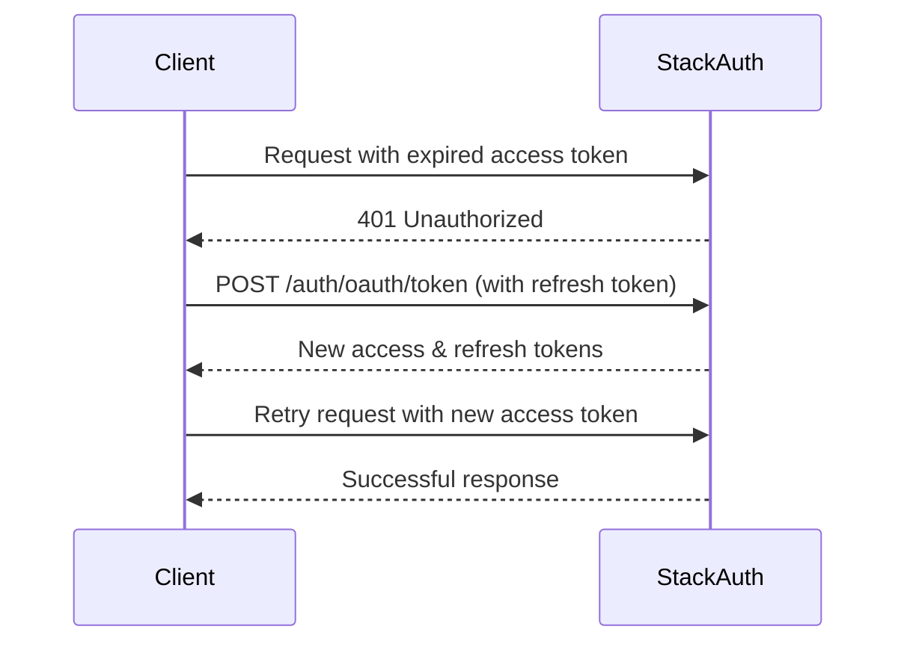

# Stack Auth REST API Documentation

## Overview

Stack Auth provides a comprehensive REST API for authentication and user management. This documentation covers all available endpoints, authentication methods, request/response formats, and token management strategies.

## Base URL

```
https://api.stack-auth.com/api/v1
```

## Authentication Headers

Stack Auth uses several headers for authentication and authorization:

### Required Headers

| Header | Description | Usage |
|--------|-------------|--------|
| `X-Stack-Project-Id` | Your Stack Auth project identifier | Required on all requests |
| `X-Stack-Access-Token` | User's access token for authenticated requests | Required for user-specific operations |
| `X-Stack-Refresh-Token` | Token for refreshing expired access tokens | Used in token refresh endpoints |
| `X-Stack-Publishable-Client-Key` | Public key for client-side operations | Required for client-side requests |
| `X-Stack-Secret-Server-Key` | Secret key for server-side operations | Required for server-side requests (never expose to client) |

### Access Type Headers

| Header | Value | Description |
|--------|-------|-------------|
| `X-Stack-Access-Type` | `client` | For client-side applications (browser, mobile) |
| `X-Stack-Access-Type` | `server` | For server-side applications with full access |
| `X-Stack-Access-Type` | `admin` | For administrative operations |

### Optional Headers

| Header | Description |
|--------|-------------|
| `X-Stack-Base-URL` | Custom base URL for self-hosted instances |
| `Authorization` | Bearer token authentication (alternative to X-Stack-Access-Token) |

## Core API Endpoints

### Authentication Endpoints

#### 1. Sign In
```http
POST /auth/signin
```
**Purpose**: Authenticate a user with email/password

**Request Headers**:
```
X-Stack-Project-Id: {projectId}
X-Stack-Publishable-Client-Key: {clientKey}
Content-Type: application/json
```

**Request Body**:
```json
{
  "email": "user@example.com",
  "password": "securePassword123"
}
```

**Response**:
```json
{
  "user": {
    "id": "user_123",
    "email": "user@example.com",
    "displayName": "John Doe"
  },
  "session": {
    "accessToken": "eyJ...",
    "refreshToken": "ref_...",
    "expiresAt": "2024-01-01T00:00:00Z"
  }
}
```

#### 2. Sign Up
```http
POST /auth/signup
```
**Purpose**: Create a new user account

**Request Body**:
```json
{
  "email": "newuser@example.com",
  "password": "securePassword123",
  "displayName": "Jane Doe"
}
```

#### 3. OAuth Token Exchange
```http
POST /auth/oauth/token
```
**Purpose**: Exchange authorization code or refresh token for access token

**Request Headers**:
```
X-Stack-Project-Id: {projectId}
X-Stack-Secret-Server-Key: {serverKey}
Content-Type: application/json
```

**Request Body (Refresh Token)**:
```json
{
  "grant_type": "refresh_token",
  "refresh_token": "ref_..."
}
```

**Response**:
```json
{
  "access_token": "eyJ...",
  "token_type": "Bearer",
  "expires_in": 3600,
  "refresh_token": "ref_..."
}
```

#### 4. Sign Out
```http
POST /auth/signout
```
**Purpose**: Invalidate current session

**Request Headers**:
```
X-Stack-Project-Id: {projectId}
X-Stack-Access-Token: {accessToken}
```

### User Management Endpoints

#### 1. Get Current User
```http
GET /users/me
```
**Purpose**: Retrieve authenticated user information

**Request Headers**:
```
X-Stack-Project-Id: {projectId}
X-Stack-Access-Token: {accessToken}
X-Stack-Access-Type: server
```

**Response**:
```json
{
  "id": "user_123",
  "email": "user@example.com",
  "displayName": "John Doe",
  "profileImageUrl": "https://...",
  "emailVerified": true,
  "createdAt": "2023-01-01T00:00:00Z",
  "metadata": {}
}
```

#### 2. Update User
```http
PATCH /users/me
```
**Purpose**: Update current user's profile

**Request Body**:
```json
{
  "displayName": "John Updated",
  "metadata": {
    "preferences": {
      "theme": "dark"
    }
  }
}
```

### Password Management Endpoints

#### 1. Send Password Reset Code
```http
POST /auth/password/send-reset-code
```
**Purpose**: Initiate password reset flow

**Request Body**:
```json
{
  "email": "user@example.com"
}
```

#### 2. Reset Password
```http
POST /auth/password/reset
```
**Purpose**: Complete password reset with code

**Request Body**:
```json
{
  "email": "user@example.com",
  "code": "123456",
  "newPassword": "newSecurePassword123"
}
```

### Email Verification Endpoints

#### 1. Send Verification Code
```http
POST /contact-channels/send-verification-code
```
**Purpose**: Send email verification code

**Request Headers**:
```
X-Stack-Project-Id: {projectId}
X-Stack-Access-Token: {accessToken}
```

**Request Body**:
```json
{
  "email": "user@example.com"
}
```

#### 2. Verify Email
```http
POST /contact-channels/verify
```
**Purpose**: Verify email with code

**Request Body**:
```json
{
  "email": "user@example.com",
  "code": "123456"
}
```

### Magic Link/OTP Endpoints

#### 1. Send Sign-In Code
```http
POST /auth/otp/send-sign-in-code
```
**Purpose**: Send one-time password for passwordless login

**Request Body**:
```json
{
  "email": "user@example.com"
}
```

#### 2. Sign In with OTP
```http
POST /auth/otp/signin
```
**Purpose**: Complete sign-in with OTP code

**Request Body**:
```json
{
  "email": "user@example.com",
  "code": "123456"
}
```

### Session Management Endpoints

#### 1. Get Current Session
```http
GET /auth/session
```
**Purpose**: Retrieve current session information

**Request Headers**:
```
X-Stack-Project-Id: {projectId}
X-Stack-Access-Token: {accessToken}
```

**Response**:
```json
{
  "id": "session_123",
  "userId": "user_123",
  "expiresAt": "2024-01-01T00:00:00Z",
  "isActive": true
}
```

#### 2. Refresh Session
```http
POST /auth/session/refresh
```
**Purpose**: Extend session with refresh token

**Request Headers**:
```
X-Stack-Project-Id: {projectId}
X-Stack-Refresh-Token: {refreshToken}
```

### OAuth Provider Endpoints

#### 1. OAuth Callback
```http
GET /handler/callback
```
**Purpose**: Handle OAuth provider callbacks

**Query Parameters**:
- `code`: Authorization code from OAuth provider
- `state`: State parameter for security
- `provider`: OAuth provider name (google, github, etc.)

### Health Check Endpoints

#### 1. Service Health
```http
GET /health
```
**Purpose**: Check Stack Auth service status

**Response**:
```json
{
  "status": "healthy",
  "timestamp": "2024-01-01T00:00:00Z"
}
```

## Response Formats

### Success Response
```json
{
  "success": true,
  "data": {
    // Response data
  }
}
```

### Error Response
```json
{
  "success": false,
  "error": {
    "code": "INVALID_CREDENTIALS",
    "message": "Invalid email or password",
    "details": {
      // Additional error context
    }
  }
}
```

### Common Error Codes

| Code | HTTP Status | Description |
|------|-------------|-------------|
| `UNAUTHORIZED` | 401 | Invalid or missing authentication |
| `FORBIDDEN` | 403 | Insufficient permissions |
| `NOT_FOUND` | 404 | Resource not found |
| `INVALID_REQUEST` | 400 | Malformed request |
| `RATE_LIMITED` | 429 | Too many requests |
| `SERVER_ERROR` | 500 | Internal server error |
| `SERVICE_UNAVAILABLE` | 503 | Service temporarily unavailable |

## Token Management

### Token Types

1. **Access Token**
   - Short-lived (default: 1 hour)
   - Used for API authentication
   - JWT format with user claims
   - Should be included in `X-Stack-Access-Token` header

2. **Refresh Token**
   - Long-lived (default: 30 days)
   - Used to obtain new access tokens
   - Opaque string format
   - Should be stored securely

### Token Refresh Flow



### Token Storage Best Practices

#### Client-Side Storage
- **Access Token**: Store in memory or sessionStorage
- **Refresh Token**: Store in httpOnly secure cookie
- Never store tokens in localStorage for security

#### Server-Side Storage
- Store tokens in encrypted session storage
- Use secure key management for encryption
- Implement token rotation on refresh

## Rate Limiting

Stack Auth implements rate limiting to prevent abuse:

- **Authentication endpoints**: 5 requests per minute per IP
- **User data endpoints**: 100 requests per minute per user
- **Password reset**: 3 requests per hour per email

Rate limit information is included in response headers:
```
X-RateLimit-Limit: 100
X-RateLimit-Remaining: 99
X-RateLimit-Reset: 1704067200
```

## CORS Configuration

For client-side applications, ensure proper CORS configuration:

```javascript
// Allowed origins must be configured in Stack Auth dashboard
const allowedOrigins = [
  'http://localhost:3000',
  'https://yourdomain.com'
];
```

## Security Considerations

1. **Never expose server keys**: Keep `X-Stack-Secret-Server-Key` server-side only
2. **Use HTTPS**: All API requests must use HTTPS in production
3. **Validate tokens server-side**: Always verify tokens on your backend
4. **Implement CSRF protection**: Use state parameters for OAuth flows
5. **Token rotation**: Regularly refresh tokens to maintain security

## Migration Notes

When migrating from Stack Auth SDK to REST API:

1. Replace SDK initialization with REST client
2. Update authentication flows to use API endpoints
3. Implement token management manually
4. Handle CORS for client-side requests
5. Update error handling for API responses

## Example Implementations

### JavaScript/TypeScript
```typescript
class StackAuthClient {
  private baseUrl = 'https://api.stack-auth.com/api/v1';
  
  constructor(
    private projectId: string,
    private publishableKey: string,
    private serverKey?: string
  ) {}

  async signIn(email: string, password: string) {
    const response = await fetch(`${this.baseUrl}/auth/signin`, {
      method: 'POST',
      headers: {
        'Content-Type': 'application/json',
        'X-Stack-Project-Id': this.projectId,
        'X-Stack-Publishable-Client-Key': this.publishableKey
      },
      body: JSON.stringify({ email, password })
    });
    
    if (!response.ok) {
      throw new Error('Authentication failed');
    }
    
    return response.json();
  }
}
```

### cURL Examples
```bash
# Sign in
curl -X POST https://api.stack-auth.com/api/v1/auth/signin \
  -H "X-Stack-Project-Id: YOUR_PROJECT_ID" \
  -H "X-Stack-Publishable-Client-Key: YOUR_CLIENT_KEY" \
  -H "Content-Type: application/json" \
  -d '{"email":"user@example.com","password":"password123"}'

# Get current user
curl https://api.stack-auth.com/api/v1/users/me \
  -H "X-Stack-Project-Id: YOUR_PROJECT_ID" \
  -H "X-Stack-Access-Token: YOUR_ACCESS_TOKEN" \
  -H "X-Stack-Access-Type: server"
```

## Additional Resources

- [Stack Auth Dashboard](https://app.stack-auth.com) - Manage projects and configuration
- [Official Documentation](https://docs.stack-auth.com) - Comprehensive guides and references
- [SDK Migration Guide](https://docs.stack-auth.com/migration) - Migrating from SDK to REST API